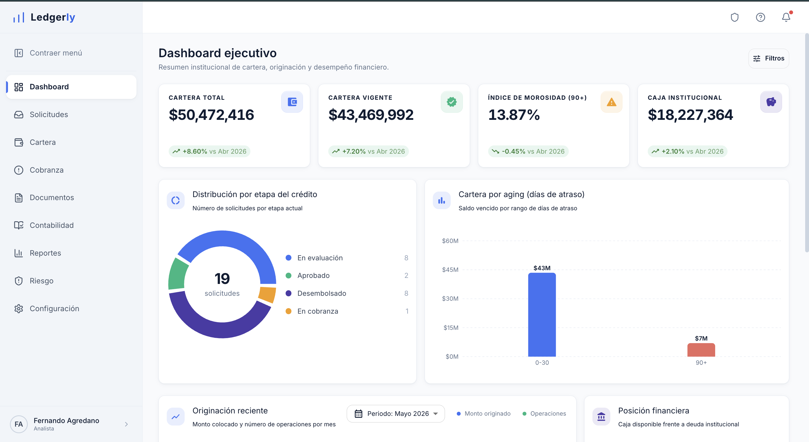

<div align="center">

# Ledgerly

**Plataforma institucional de crédito privado para PYMES**

Un LOS/LMS (Loan Origination & Servicing System) completo — no un dashboard con
gráficas, sino el ciclo de vida entero de un crédito: originación, scoring,
comité, dispersión, ledger contable en doble partida, cobranza y monitoreo de
cartera, con persistencia real en base de datos.

[](https://react.dev)
[](https://www.typescriptlang.org)
[](https://vitejs.dev)
[](https://tailwindcss.com)
[](https://supabase.com)



</div>

## Contenido

- [¿Qué es esto?](#qué-es-esto)
- [Funcionalidad](#funcionalidad)
- [Stack](#stack)
- [Modelo de datos](#modelo-de-datos)
- [Cómo correrlo](#cómo-correrlo)
- [Estructura del proyecto](#estructura-del-proyecto)
- [Contexto para desarrollo asistido por IA](#contexto-para-desarrollo-asistido-por-ia)

## ¿Qué es esto?

Ledgerly simula una SOFOM institucional que financia PYMES mexicanas mediante
garantía inmobiliaria y pagaré, con fondeo propio a través de una línea
revolvente bancaria. El objetivo del proyecto fue construir el sistema
operativo completo detrás de ese negocio — no una demo visual, sino un flujo
real donde cada pantalla lee y escribe contra una base de datos con reglas de
negocio, seguridad a nivel de fila y trazabilidad contable de verdad.

Esto significa que las acciones tienen consecuencias reales dentro del
sistema: aprobar un crédito en comité lo mueve a dispersión, dispersar un
crédito genera automáticamente sus asientos contables en doble partida
(carga a cartera vigente, abono a bancos), y todo reporte financiero se
construye a partir de esos mismos datos — nunca de números inventados en el
frontend.

## Funcionalidad

**Originación y underwriting**
- Pipeline de solicitudes con etapas (evaluación → análisis → comité →
  aprobado/rechazado → dispersado) y expediente digital por solicitud.
- Scoring compuesto (KYC, capacidad de pago, garantía, legal, rentabilidad) y
  clasificación de riesgo.
- Validaciones PLD contra listas de sanciones (OFAC, ONU, SAT 69-B, PEP,
  beneficiario controlador, noticias negativas).
- Comité de crédito con votos, condiciones aprobadas y bitácora de decisión.
- Dispersión con flujo de fondeo, control dual y generación automática de
  asientos contables.

**Cartera y cobranza**
- Vista 360° de cada crédito: condiciones, tabla de amortización, estado de
  cuenta descargable en PDF.
- Cobranza por buckets de mora (temprana, intensiva, jurídica) con alertas
  automáticas, bitácora de acciones y generación de convenios de pago.
- Documentos recurrentes por crédito (estados financieros, opinión 32-D,
  avalúos) con alertas de vencimiento.

**Contabilidad y reportes**
- Ledger inmutable en doble partida con plan de cuentas institucional,
  conciliación SPEI y libro mayor.
- Provisiones automáticas por bucket de mora (1% / 5% / 15% / 35% / 75%).
- **16 reportes reales** (financieros, de cartera, regulatorios y operativos)
  que se generan como PDF con formato institucional tipo factura — folio,
  periodo, resumen en tarjetas y tablas — a partir de datos reales, con
  histórico de cada descarga.

**Riesgo**
- Concentración por cliente/sector (índice de Herfindahl), análisis de
  vintage/cosechas, early-warning indicators y escenarios de stress testing
  (choques de tasa, deterioro de garantía, depreciación cambiaria).

**Plataforma**
- Login real con Supabase Auth (sesión persistente) y foto de perfil en
  Supabase Storage.
- Notificaciones en tiempo real (Supabase Realtime) cuando cambia cartera,
  documentos o el pipeline de solicitudes.
- Sistema de notificaciones toast reutilizable en toda la app.
- Row Level Security en todas las tablas operativas.

## Stack

| Capa | Tecnología |
|---|---|
| Frontend | React 18 · TypeScript · Vite · Tailwind CSS |
| Componentes de datos | Material UI (solo en el Dashboard) · Recharts |
| Backend | Supabase — Postgres, Auth, Storage, Realtime, Row Level Security |
| Documentos | jsPDF + jspdf-autotable (PDFs con membrete institucional) |
| Enrutamiento | React Router v6 |

## Modelo de datos

La base de datos (Postgres vía Supabase) modela el negocio con:

- **Contabilidad de doble partida real**: `cuentas_contables` (plan de
  cuentas) + `asientos_contables` (ledger inmutable) + `v_libro_mayor` (saldos
  derivados) — nunca se guarda un "saldo" directamente, siempre se calcula
  desde los movimientos.
- **Vistas materializadas para cada pantalla**: KPIs de dashboard, aging de
  cartera, concentración, vintage, alertas de cobranza — la UI nunca agrega
  datos client-side que debería calcular la base de datos.
- **RLS en todas las tablas operativas**: lectura pública de demo, escritura
  restringida a usuarios autenticados.
- Detalle completo del esquema, las migraciones y cómo reproducirlo en
  [`supabase/README.md`](supabase/README.md).

## Cómo correrlo

```bash
npm install
cp .env.example .env.local   # completa con tu URL y anon key de Supabase
npm run dev
```

| Comando | Qué hace |
|---|---|
| `npm run dev` | Servidor de desarrollo (Vite) |
| `npm run build` | Type-check (`tsc`) + build de producción |
| `npm run preview` | Sirve el build de producción localmente |

## Estructura del proyecto

```
src/
├── pages/          # Una página por ruta (Dashboard, Solicitudes, Cartera, Reportes...)
├── components/      # Componentes compartidos (Sidebar, Topbar, Logo, ui/*)
├── hooks/           # useAuth, useProfile, useToast, useFetch
├── lib/             # api.ts (Supabase), format.ts, pdf.ts, types.ts
└── layouts/         # AuthLayout (login) y layout autenticado

supabase/
├── migrations/       # Esquema versionado, aplicado con `supabase db push`
├── seed*.sql        # Datos iniciales (clientes, créditos, fondeo, pipeline)
└── README.md        # Cómo reproducir la base de datos completa
```

## Contexto para desarrollo asistido por IA

Los siguientes archivos **no son parte de la aplicación** — el frontend nunca
los importa ni los ejecuta. Son contexto de dominio pensado para trabajar en
este repo con un asistente de código con IA (Claude Code):

| Archivo / carpeta | Propósito |
|---|---|
| `CLAUDE.md` | Instrucciones de proyecto que el asistente carga automáticamente: identidad institucional, cómo debe pensar (CRO/CFO/Head of Credit), qué debe analizar siempre en cada tarea. |
| `knowledge/` | Glosario y reglas de negocio de dominio (contabilidad, cobranza, compliance, scoring, tesorería, rentabilidad) que sirven de referencia rápida al asistente. |
| `agents/` | Definición de especialidades (riesgo de crédito, cobranza, jurídico, tesorería) pensadas como subagentes enfocados en un dominio. |
| `memory/` | Bitácora de decisiones institucionales a registrar (excepciones, ajustes de política, decisiones de comité). |
| `scenarios/` | Casos de estrés a considerar en análisis de riesgo (choques de tasa, deterioro de garantía, depreciación cambiaria). |

La idea es que cualquier tarea de desarrollo sobre este repo —agregar un
reporte, ajustar el scoring, revisar una política de cobranza— se resuelva con
el mismo criterio institucional que usaría un equipo de riesgo real, en vez de
depender de que cada sesión repita ese contexto desde cero.

---

<div align="center">

Hecho por **Fernando Agredano**

</div>
